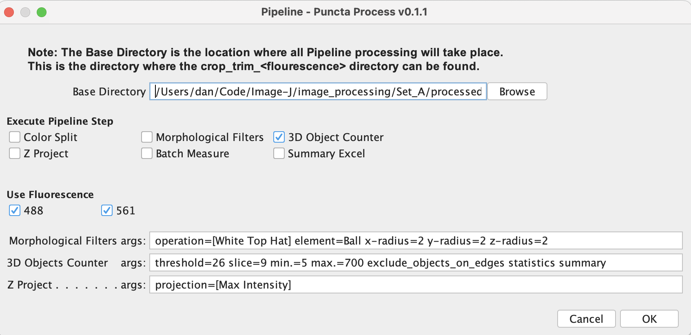
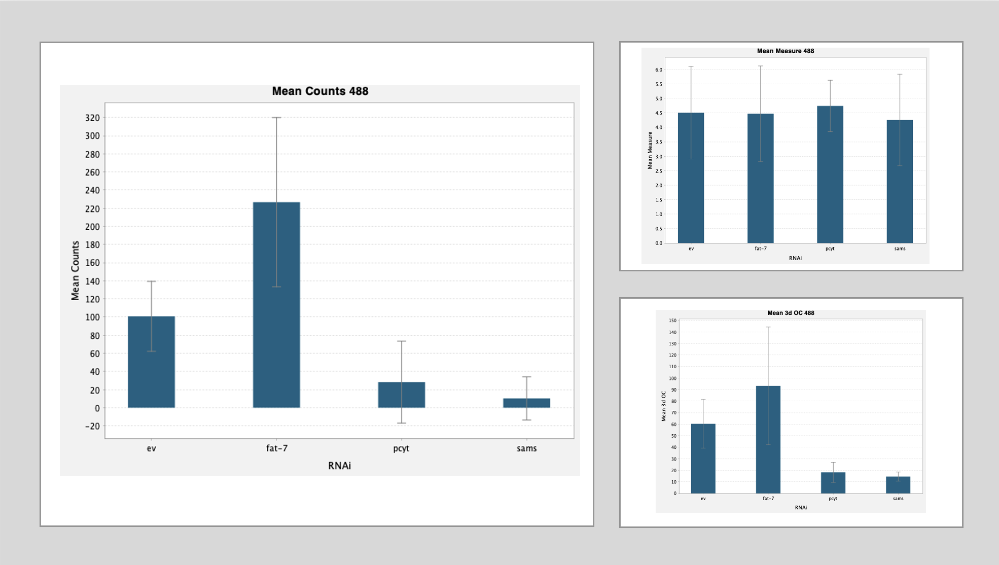
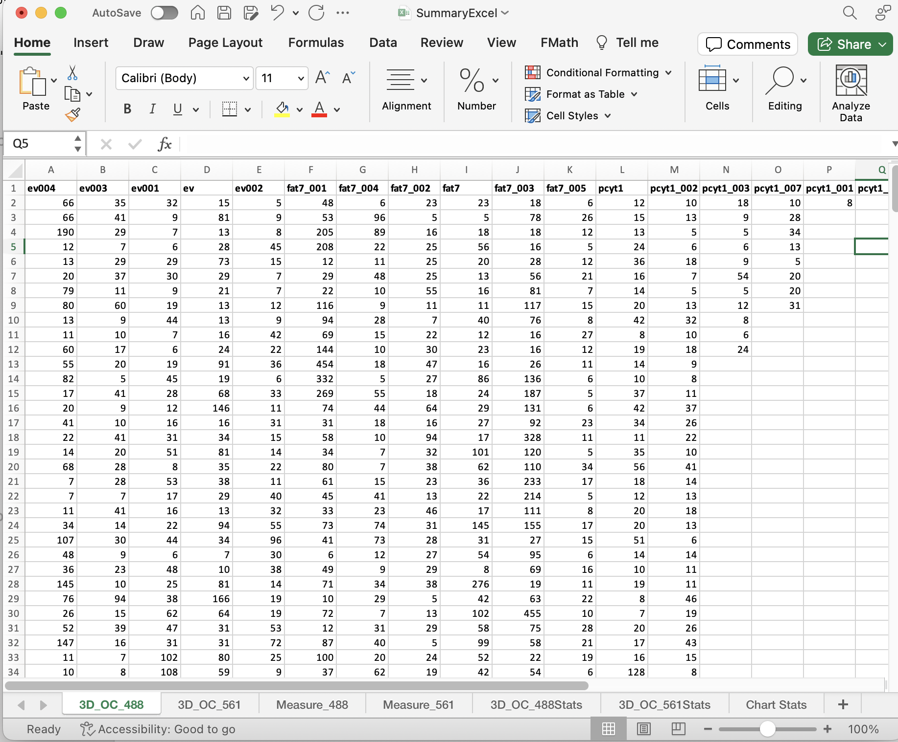

# Puncta Process ImageJ PlugIn

Overview
--------

The __Puncta Process ImageJ PlugIn__ is a pipeline for preparing image data, identifying puncta counts, and summarizing the findings into MS Excel and CSV file formats. 

* The pipeline rely on a number of plugins that are automatically installed with the latest Fiji version of ImageJ.

*  __Fiji__ can be installed from <a href="https://imagej.net/software/fiji/">here</a>

Installation
-----------------

> 1. Select _Help > Update..._ from the Fiji menu to start the updater.

> 2. Click on _Manage update sites_. This brings up a dialog where you can activate additional update sites.

> 3. Activate the Cuncta_Process update site and close the dialog. Now you should see an additional PlugIn available for download.

> 4. Click _Apply changes_ and restart Fiji.

Additional Dependency
---------------------

 <a href="https://github.com/ijpb/MorphoLibJ">MorphoLibJ</a>
=================

Screenshots
-----------

 

 

